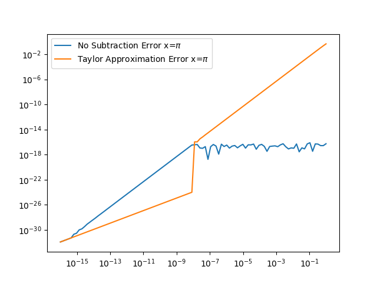

```{r setup, include=FALSE}
knitr::opts_chunk$set(echo = TRUE)
```

## Problem 1
i) and ii)

{#id .class width=50% height=50%}

iii) The difference is that when we evaluate $p(x)$ using the coefficients, we are encountering a loss of precision at every step in the multiplication. The jagged lines shown are caused by this loss of precision, and are not accurate. When we evaluate $p(x)$ using the polynomial form, the accuracy is significantly better since the code accounts for the fact that there is multiple calculations and the rounding error is added at the end. Thus, the orange plot is the correct visualization of $p(x)$.

## Problem 2
i) $\sqrt{x+1} - 1$ for $x\approx0$.

$\sqrt{x+1} - 1 = \frac{(\sqrt{x+1} - 1)(\sqrt{x+1} + 1)}{(\sqrt{x+1} - 1)} = \frac{x+1-1}{\sqrt{x+1} - 1} = \frac{x}{\sqrt{x+1} - 1} \approx \frac{x}{2}$

ii) $sin(x)-sin(y)$ for $x\approx y$.

$sin(x)-sin(y) = 2cos(\frac{x+y}{2})sin(\frac{x-y}{2})$

iii) $\frac{1-cos(x)}{sin(x)}$ for $x\approx0$.

$\frac{1-cos(x)}{sin(x)} = \frac{1-cos(x)}{sin(x)}(\frac{1+cos(x)}{1+cos(x)}) = \frac{1-cos^2(x)}{sin(x)(1+cos(x))} = \frac{sin^2(x)}{sin(x)(1+cos(x))} = \frac{sin(x)}{1+cos(x)} \approx \frac{sin(x)}{2}$

## Problem 3
$P_2(x) = f(0) + f'(0)x + \frac{1}{2}f''(0)x^2$

$f'(x) = -(1+x+x^3)sin(x)+cos(x)(1+3x^2)$

$f'(0) = 1$

$f''(x) = -cos(x)(1+x+x^3) - sin(x)(1+3x^2)+6xcos(x) - sin(x)(1+3x^2)$

$f''(0) = -1$

$P_2(x) = 1 + x - \frac{1}{2}x^2$

a) $f(0.5) \approx P_2(0.5) = 1 + 0.5 + \frac{1}{2}(0.5)^2 = \frac{3}{2} - \frac{1}{8} = \frac{11}{8}$

Upper bound: $|f(0.5) - P_2(0.5)| \le M \frac{0.5^3}{3!} = \frac{(3)(1/8)}{6} = \frac{1}{16}$

Actual error: 0.05107

b) $|f(x) - P_2(x)| \le M \frac{x^3}{6}$, where $M = |f'''(\varepsilon)|, \varepsilon \in [0,x]$

c) $\int_0^1 f(x)dx \approx \int_0^1 P_2(x)dx = \int_0^1 (1+x-\frac{1}{2}x^2)dx = x+\frac{x^2}{2}-\frac{x^3}{6}|_0^1 = \frac{4}{3}$

d) Upper bound: $|\int_0^1 f(x)dx - \int_0^1 P_2(x)dx| \le \int_0^1 |R_2(x)|dx = \int_0^1 \frac{16x^2}{6}dx = \frac{16x^3}{18}|_0^1 = \frac{16}{18} = \frac{8}{9}$
Note: this is a very large upper bound on the error, so I will also just use numerical approximation and find the actual error.

Actual error $\approx |1.394 - 0.0625| \approx 1.332$.

## Problem 4
$ax^2+bx+c = 0$, a = 1, b = -56, c = 1

$x^2-56x+1=0$

a) $r_{1,2} = \frac{56\pm\sqrt{56^2-4}}{2} = \frac{56\pm\sqrt{3132}}{2} \approx \frac{56\pm55.964}{2}$

$r_1 \approx 55.982$, relative error = $2.450 * 10^{-6}$

$r_2 \approx 0.018$, relative error = $0.008$

Since the relative error for the second root is larger, we are assuming the second root to be the "bad" root.

b) $(x_1 - r_1)(x_2 - r_2) = 0$

$x^2 - (r_1+r_2)x + r_1r_2 = 0$

The two relations found are that $r_1 + r_2 = 56$ and $r_1r_2 = 1$.

Plugging in $r_1$ to the first relation:

$r_2 = 56 - 55.982 = 0.018$, which will not improve the accuracy as it is the same as before.

Now for the second relation:

$r_2  = 1/55.982 \approx 0.017$, which is the value found when computed without rounding, meaning we lose no precision!

## Problem 5

a) Using the triangle inequality: 

Absolute error: $|\Delta y| = |\Delta x_1 - \Delta x_2| =  |\Delta x_1 + (- \Delta x_2)| \le |\Delta x_1|+ |(- \Delta x_2)| =|\Delta x_1|+ |\Delta x_2|$

Relative error: $\frac{|\Delta y|}{|y|} = \frac{|\Delta x_1 - \Delta x_2|}{|x_1 - x_2|} \le \frac{|\Delta x_1| +| \Delta x_2|}{|x_1 - x_2|}$
 
Thus the relative error is large when the denominator is small, that is when $x_1$ and $x_2$ are close in value to each other.

b) $cos(x+\delta) - cos(x) = -2cos(\frac{2x+\delta}{2})sin(\frac{\delta}{2})$

{#id .class width=50% height=50%}

As you can see, the manipulation without subtraction is extremely small for both values of x.
\newpage
c) I chose to use $f(x) = -\delta sin(x)$ as the approximation. This is because the factor of $\delta ^2$ causes the $\varepsilon$ term to be essentially negligible for most of the values of $\delta$ given.

{#id .class width=50% height=50%}

{#id .class width=50% height=50%}

For $x=10^6$, the first part of the plot for the no subtraction method is cut off due to the log-scale and the fact that the error is so small for the smaller delta values.

## Code Access

I added hw1.py to my testrep on Github.